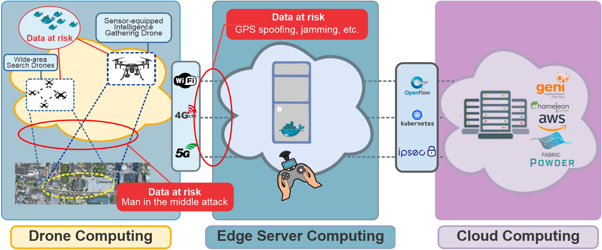
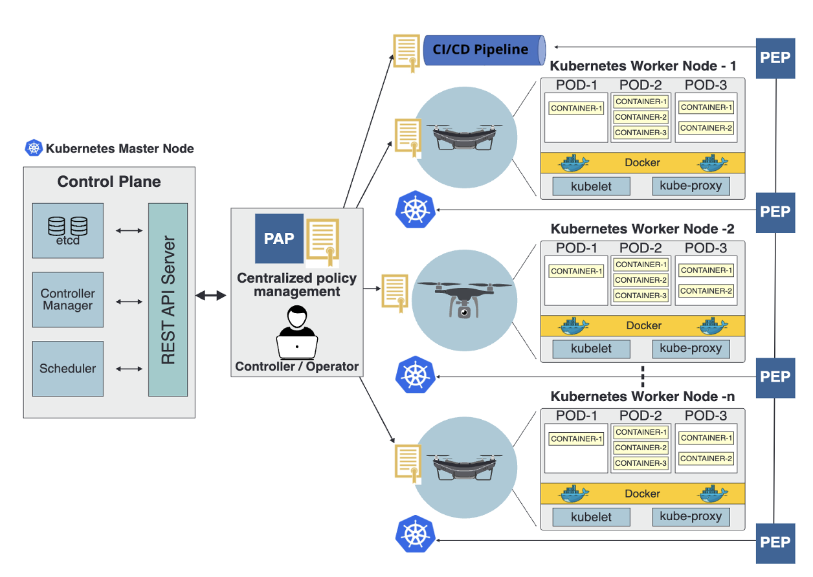

# **Chapter 1** - Overview

## 1.1 Purpose of the Lab
In this lab, you will learn how to use the Arculus Ground Control Portal to configure, manage, and execute secure drone missions on the Arculus edge-security testbed. Building on the Terraform module you completed earlier, this lab assumes your Arculus Portal and controller node are already provisioned and running.

You will explore how to onboard new drone devices (EC2 instances), securely join them to the Arculus cluster, configure each device with trusted drone roles and capabilities, create mission manifests, and launch fully-simulated missions with live monitoring. You’ll also learn how Arculus enforces Zero-Trust through role-based access control, device attestation, dynamic network policies, and mission-driven privilege enforcement (TBAC).

## 1.2 Prerequisites
To follow along and get the most out of this module, you should:

* Have the Arculus Portal fully deployed using the previous Terraform module.

* Have three or more EC2 instances available to use as drones (or be ready to provision them).

* Understand basic AWS concepts (EC2, key pairs, security groups).

* Be comfortable using a terminal (to run join scripts on each drone EC2).

* Have access to Git and the ability to SSH into EC2 instances.

* Have basic familiarity with the Arculus Portal interface (user management, device management).

* Understand JSON/HCL at a beginner level.

* Have a working knowledge of networking basics (CIDR, ports, inbound/outbound rules).

## 1.3 References to guide lab work
Please use the links below to learn the related information for this lab. 

* <a href = "https://github.com/arculus-zt/arculus-sw/tree/master">*Arcluus GitHub Repository*</a> - The GitHub repository for all files related to the software of Arculus.
* <a href="https://docs.aws.amazon.com/cli/latest/userguide/cli-chap-welcome.html">*AWS CLI*</a> - Command-line tool to configure credentials and run AWS service commands from your terminal.
* <a href ="https://docs.aws.amazon.com/systems-manager/latest/userguide/session-manager.html">*AWS Systems Manager SSM*</a> - Secure, logged shell access to instances via browser/CLI without SSH keys or open ports.
* <a href = "https://docs.k3s.io/">*AWS K3s*</a> - K3s - Lightweight Kubernetes
* <a href = "https://aws.amazon.com/">*AWS (Amazon Web Services)*</a> - A cloud platform that offers a variety of services, including storage, compute, and databases. AWS allows users to build and run applications on-demand.

## 1.4 Overview:

In this lab, we’ll use the Arculus Portal to configure, secure, and execute autonomous drone missions on your already-deployed Arculus testbed. You will learn how to onboard new drone devices (EC2 instances), assign trusted roles, validate mission capabilities, generate encrypted mission manifests, and run full mission simulations — all while observing how Arculus enforces Zero-Trust in real time.

Drone nodes are lightweight Linux EC2 instances that join the Arculus cluster and take on specific roles such as Surveillance Drone, Supply Drone, Relay Drone, or Mission Controller. Each drone must be enrolled, approved, and assigned capabilities before it can participate in a mission. Arculus automatically validates whether a device has the privileges needed to execute its tasks.

Arculus provides an interactive Mission Planning Dashboard where you can select devices, set mission criticality, choose map destinations, and download encrypted mission configuration files. During execution, Arculus activates temporary network-access policies, streams live telemetry, and enforces strict task-based restrictions to ensure that each drone performs only what it is authorized to do.

**Why Arculus for this module?**

* Zero-Trust Simulation: Every drone must authenticate, be approved, and possess the correct privileges before the mission can begin.

* Dynamic Policies: Arculus creates and removes network policies automatically during mission execution.

* Hands-on Device Security: Students learn how enrollment, attestation, capability validation, and mission manifest verification work in practice.

* Safe Experimentation: Live mission execution includes built-in DDIL simulations (GPS spoofing, comms loss, battery constraints, etc.) without risking real hardware.

## 1.5 Conceptual Overview

 

 <i> Figure 1.1 illustrates the high-level ecosystem in which drone missions operate. On the left, we have the Drone Computing layer: wide-area search drones and sensor-equipped intelligence-gathering drones collect real-time data. This data is highly sensitive and vulnerable to compromise, especially during aerial operations. Threats such as man-in-the-middle attacks, physical interference, and spoofed telemetry create significant risk at this layer. In the center, the Edge Server Computing layer acts as a local command station for mission execution. This includes communication paths over Wi-Fi, 4G LTE, and 5G — all of which are susceptible to GPS jamming, spoofing, or disruption. The edge servers run containerized applications (e.g., Docker on lightweight clusters) to process telemetry, control mission logic, and maintain low-latency responsiveness. Technologies such as Kubernetes, OpenFlow, and IPsec provide orchestration and secure communication channels. On the right, the Cloud Computing layer supports intensive analytics, large-scale storage, and long-running workloads on platforms such as AWS, FABRIC, Powder, and Chameleon. These cloud environments support mission analytics, training data pipelines, long-term storage, and cross-mission correlation. Together, the three layers form a complete end-to-end architecture linking drones, edge nodes, and cloud services.</a> </i> 

 

 <i> Figure 1.2 provides a conceptual model of how drones are securely managed through a Kubernetes-based control plane. At the top left, the Kubernetes Master Node runs essential components such as the API Server, Controller Manager, Scheduler, and etcd. This is where the mission operator interacts with the system. The Policy Administration Point (PAP) serves as the central authority for creating and distributing policies that govern drone capabilities, allowed operations, and inter-drone communication flows. Policies are then transmitted to drone nodes — represented here as Kubernetes worker nodes — each hosting containerized drone services. Every drone node includes its own Policy Enforcement Point (PEP), which ensures that only approved actions and communications occur. For example, the surveillance drone can only collect and forward sensor data, while the supply drone is restricted to transport tasks. All compliance is enforced through kubelet, kube-proxy, and container-level controls running under Docker. This architecture demonstrates how Arculus integrates with concepts from modern container orchestration, enabling fine-grained, task-based security. Policies flow top-down from the PAP, and each drone node enforces them locally, ensuring mission integrity even when devices operate across unreliable or adversarial environments.</a> </i> 

## 1.6 Goals/Outcomes:
By the end of this lab module, you will be able to:

(i) Understand the Arculus Drone Mission Workflow

* Explain how devices join the Arculus cluster and why approval and identity are required.

* Describe how Arculus enforces Zero-Trust during mission planning and mission execution.

* Understand how task-based access control (TBAC) ensures each drone performs only allowed operations.

(ii) Enroll and Configure Drone Nodes

* Launch EC2 instances to act as drone devices and run the join script generated by the Arculus Portal.

* Approve cluster join requests and assign trusted drone roles (Surveillance, Supply, Relay, Controller).

* Configure and update device capabilities that determine what each drone can do during a mission.

(iii) Apply Zero-Trust Guardrails for Mission Safety

* Validate that each drone device has the required privileges before a mission can be created.

* Understand how Arculus blocks mission creation when capabilities are missing or misconfigured.

* Explain how Arculus dynamically generates and removes network policies during mission execution.

(iv) Create and Validate Mission Manifests

* Plan a mission using the Mission Planning Dashboard (devices, supervisors, viewers, criticality).

* Set a mission destination using the map interface and handle validation prompts.

* Generate encrypted mission manifest (.mconf) files and understand how Arculus prevents tampering.

(v) Execute and Monitor a Drone Mission

* Launch missions using the Arculus Portal and observe live telemetry during execution.

* View real-time drone movement, logs, and health information in the Mission Execution Dashboard.

* Use built-in controls to simulate DDIL conditions (GPS spoofing, communication loss, DoS, hijacking, low battery).

* Observe how Arculus automatically enforces communication rules and revokes temporary permissions after mission completion.

(vi) Prepare Drone Nodes for Arculus Testbed Integration

* Expose the correct identifiers (instance IPs, roles, capabilities, privileges) required for mission workflows.

* Align device naming and configuration to support later chapters on honeypots, threat simulation, or multi-drone coordination.

* Understand how cloud-provisioned EC2 drone nodes map to real drone behaviors in the Arculus environment.
