# **Chapter 2** - Provisioning EC2 using CloudShell & Terraform

## 2.1 Overview

In this chapter, you’ll use the Arculus Ground Control Portal to begin adding drone devices (EC2 instances) into your Arculus cluster. Since the Arculus Portal is already deployed from the previous module, our focus here is on onboarding new nodes, approving join requests, and preparing each device to become a mission-capable drone.

You’ll start by navigating to the Add Nodes page in the Arculus UI, where you will generate a custom enrollment script for each drone. This script will be copied into your EC2 instances and executed to initiate a secure cluster join request. Once the request appears in the Device Management Dashboard, you’ll approve the node and verify that it successfully registers as part of the cluster.

By the end of this chapter, you will have all required drone nodes—such as a Surveillance Drone, Supply Drone, Relay Drone, and Mission Controller.

## 2.2 Adding Drone Nodes to the Arculus Cluster

* Log in to the Arculus Ground Control Portal using your instructor-provided credentials.
* From the left sidebar, click Add Nodes.

 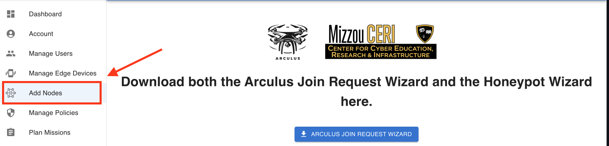

* You’ll see a simple form where you can enter the name of the new device you want to add to the cluster.

 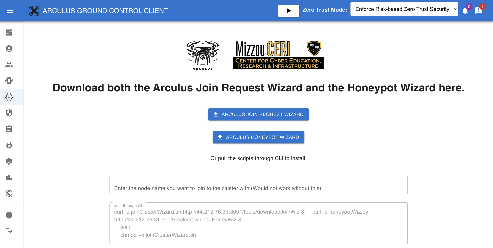

### 2.2.1 Generate the Join Script

* In the Add Nodes page, type a name for your new device (e.g., ``surveillance-drone``).
* Click **Generate Script**.

* Arculus produces a custom join script containing: Device name, Device identity token, Backend join URL, Required dependencies
* Click Copy to Clipboard to copy the script.

 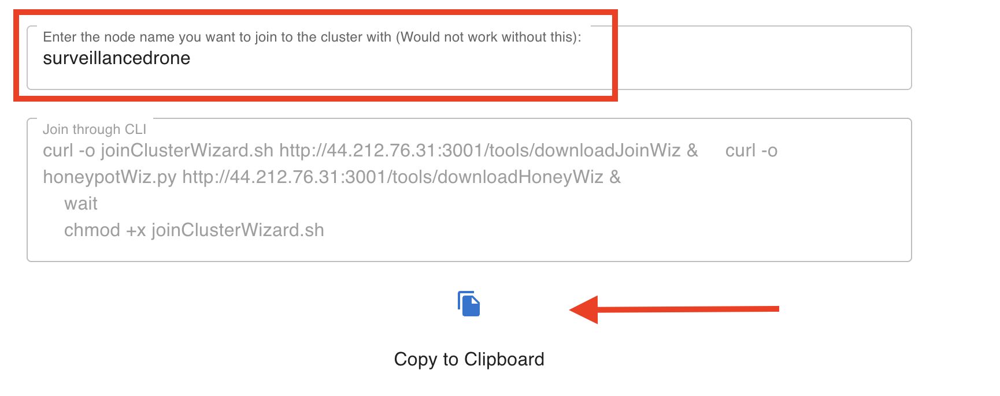

### 2.2.2 Launch an EC2 instance

* Sign back into your AWS Management Console
* Make sure to select the **US East (N. Virginia)** region in the top-right part of your screen.

 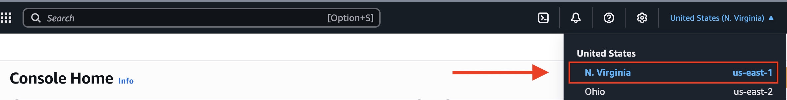

* On the top left corner, search "**EC2**" and click on the service.

 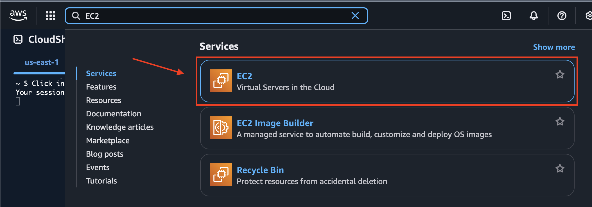

* On the right side of the page, click "**Instances**" 

 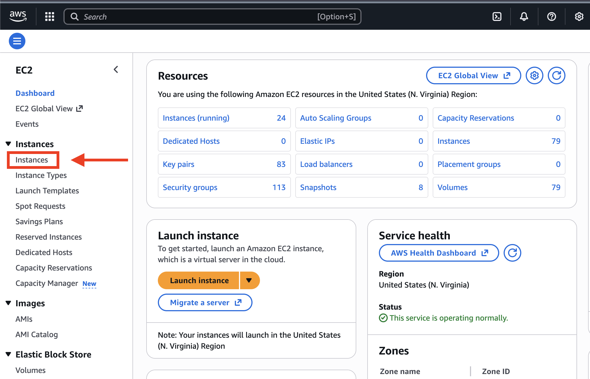

* On the top-right corner, click "**Launch Instance**". 

 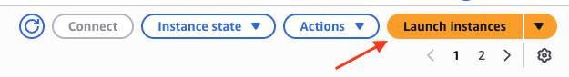

* Make sure to launch **3 EC2 instances**. These three instances are your drones for this module.

 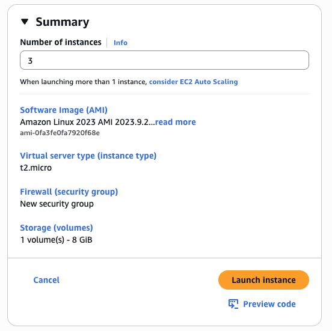

* Give your instances a name. For example, in the picture below, "``drone1``". In the three instances that are launched, we will be changing the names of the other two later in the exercises.

 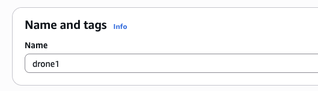

* Select **Ubuntu 24.04 LTS** as the instance's operating system.

 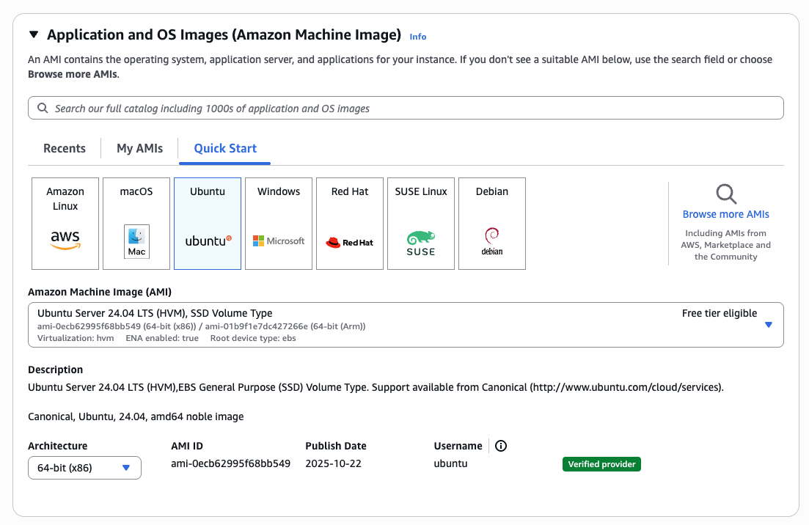

* The instance type we will be using for this module is **t2.medium**.

 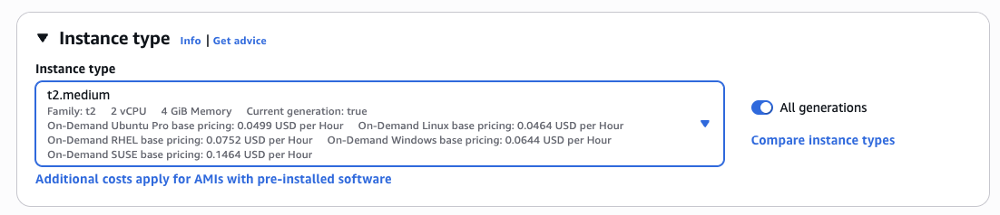

* Use the same key that was created when provisioning resources using Terraform for the Arculus portal. If not created, you can create new key pair.

 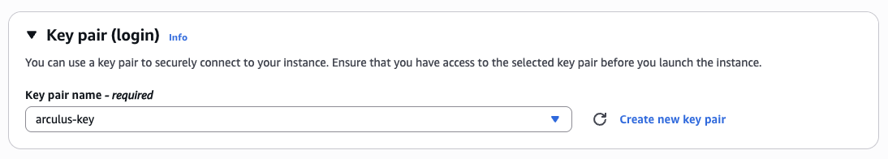

* Select the **existing security group** option. Within the drop-down menu, search for the arculus security group that was created when provisioning resources for the Arculus portal using Terraform.

 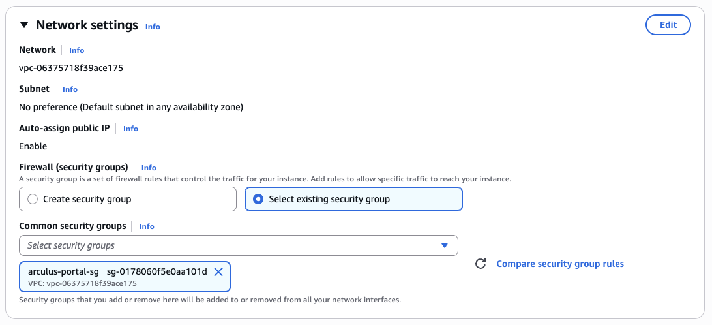

* Click "**Launch**"

 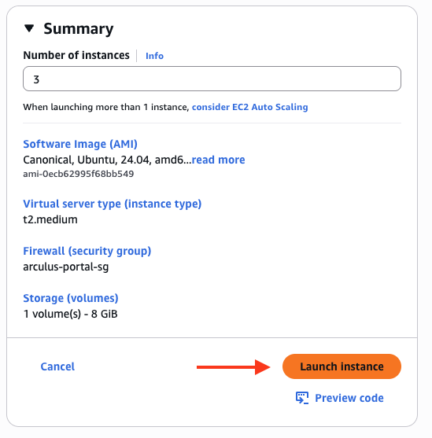

### 2.2.3 Rename the launched instances

* In the search bar, search for **drone1** and you will see three of your launched instances.

 

* Rename two of those launched instance. For example, in the picture below, change the names to **drone2** and **drone3***

 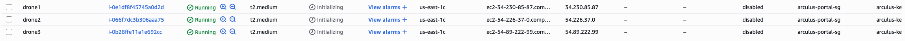

